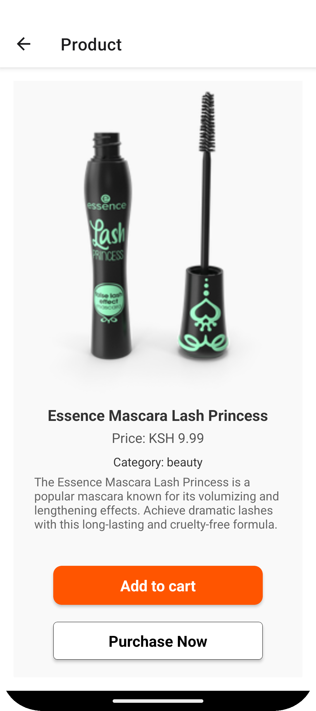
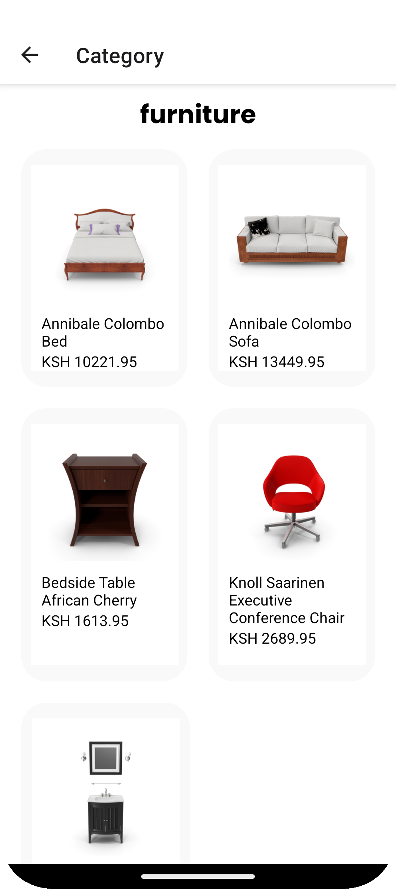

# Screenshots
---
<div>
</img>
</img>
</img>
</img>
</img>
</img>
</img>
</img>
</img>

</div>

---
# 1. Home Screen Component

The `index` component serves as the main screen for the app, showcasing various categories, banners, and carousels within a scrollable layout. It includes multiple sub-components, making it an interactive and visually engaging entry point for users.
---
<div>
</img>
</img>
</img>
</div>

---
## Features
- **Search Bar**: Provides a search input for users to search for items.
- **Carousel**: Displays a carousel for showcasing images or promotions.
- **Category Navigation**: Allows users to navigate between different product categories.
- **Category Card**: Highlights a specific category in a card format.
- **Banner**: Displays promotional content.
- **Category Hero**: Emphasizes selected categories with larger visuals.
- **Category List**: Renders a list of specific categories for user browsing.

## Installation
Ensure your environment is set up with React Native. Install any dependencies with:

```bash
npm install
```

## Usage
Import and render the `index` component within your app:

```javascript
import HomeScreen from './path/to/index';

export default function App() {
  return (
    <HomeScreen />
  );
}
```

## Components Used
- **SearchBar**: Component for searching content.
- **CarouselComponent**: Displays a scrolling carousel with images.
- **CategoryNav**: Navigation for different categories.
- **CategoryCard**: A card view for an individual category.
- **Banner**: Showcases promotional content or advertisements.
- **CategoryHero**: Highlights specific categories.
- **CategoriesComponent**: Renders items within specified categories (e.g., smartphones, women's shoes, laptops).

### Props
This component doesn't accept external props directly; it renders predefined categories in `CategoriesComponent`.

## Code Overview

1. **ScrollView Layout**:
   - A `ScrollView` provides a vertically scrollable interface for viewing all sections.
   - Margin is added at the bottom to ensure spacing.

2. **Component Usage**:
   - The `SearchBar` appears at the top, followed by each section in a sequential order: `CarouselComponent`, `CategoryNav`, `CategoryCard`, `Banner`, `CategoryHero`, and `CategoriesComponent` (which displays multiple predefined categories).

3. **Styles**:
   - The main style `container` aligns items to the center, provides a full-width layout, and sets a white background.

## Example

```javascript
import HomeScreen from './path/to/index';

function App() {
  return <HomeScreen />;
}
```

## Styles

The primary style, `container`, ensures that the layout is centered, full-width, and has a white background color.

---

## Additional Notes
- Ensure that each imported component (e.g., `SearchBar`, `Banner`, `CarouselComponent`) is implemented correctly in the specified paths.
- You can extend this component by customizing the categories displayed in `CategoriesComponent` or adjusting layout and styling for a personalized experience.

---


# 2. Cart Tab screen

The `Cart` component is a React Native screen that displays items added to a shopping cart, provides functionality for managing items (deleting individual items or clearing all items), and offers a "Cash Out" feature that generates a receipt modal.
---
</img>

---

### Features

- **Fetch Cart Items**: Retrieves items from a Firestore collection (`cartItems`) when the component is focused, using `useFocusEffect`.
- **Delete Item**: Allows users to delete a specific item from the cart, updating Firestore and the local state.
- **Delete All Items**: Clears all items from the cart, both locally and in Firestore, using a batch delete for efficiency.
- **Total Calculation**: Calculates and displays the total price of items in the cart.
- **Cash Out with Receipt Modal**: When users press "Cash Out," a modal displays a receipt with item details and the total amount.
- **Order Confirmation Message**: Shows a confirmation message after an order is placed and items are cleared from the cart.

### Key Components

- **State Variables**
  - `cartItems`: Stores items in the cart.
  - `loading`: Indicates data loading state.
  - `error`: Stores error messages, if any.
  - `showModal`: Controls the visibility of the receipt modal.
  - `orderPlaced`: Tracks whether the order has been placed.

- **Main Functions**
  - `fetchCartItems()`: Asynchronously fetches cart items from Firestore and updates `cartItems`.
  - `deleteItem(id)`: Deletes a specific item by ID from Firestore and updates the local cart state.
  - `deleteAllItems()`: Uses Firestore's batch operations to delete all cart items, then clears the local cart state.
  - `calculateTotal()`: Calculates and returns the total price of items in the cart.
  - `openReceiptModal()`: Opens the modal to display the receipt.
  - `closeReceiptModal()`: Closes the receipt modal, clears the cart, and displays an order confirmation message.

### Usage

1. **Navigation and Integration**: Import `Cart` and add it to your navigation stack. The component automatically fetches data on screen focus.
2. **Firestore Configuration**: Ensure Firestore is configured correctly and a collection named `cartItems` exists.
3. **Component Import**
   ```js
   import Cart from "./path-to-cart-component";
   ```

### Dependencies

- **React Native Components**: `FlatList`, `Modal`, `TouchableOpacity`, `ActivityIndicator`, and others.
- **Firestore**: Uses Firebase Firestore for data retrieval and management.
- **Ionicons**: Provides icons for item deletion.

### Example

Place the `Cart` component in your app's navigation stack or as a screen to enable users to view and manage their cart items, complete with a receipt modal for "Cash Out."

### Styles

Custom styles are defined using `StyleSheet.create()` for consistent UI and easy customization.

---

# 3. Profile Screen

This `ProfileScreen` component provides users with a profile interface in a React Native application. It displays user information, such as a profile image, name, and email, and provides navigation options to view order history, adjust settings, and access contact options like GitHub and email. Users can also log out from this screen.
---
</img>

---
## Features

- **User Information**: Displays the logged-in user's profile image, name, and email. For guests (users not logged in), it prompts to log in.
- **Navigation Options**:
  - **Order History**: Links to the user's past orders.
  - **Settings**: Provides access to adjust application settings.
  - **GitHub**: Opens the user's GitHub profile in the browser.
  - **Email Contact**: Opens the default mail app for contacting support or the developer.
- **Logout**: Signs out the current user and redirects to the login screen.
- **Login Prompt**: If no user is logged in, a login button is provided.

## Dependencies

- **Firebase**: Used for user authentication and session management.
- **Expo Router**: Provides navigation between screens.
- **React Native Components**: Uses core components like `View`, `Text`, `Image`, and `ScrollView`.
- **Ionicons**: Icon library for navigation and social icons.

## Code Overview

### Key Functions

- **`useEffect`**: Listens to Firebase authentication state changes to set the user context.
- **`handleLogout`**: Signs out the user and navigates to the login screen.
- **`openGithub` & `openGmail`**: Opens GitHub and email contact options using `Linking`.

### Style Customization

The component's styles (`StyleSheet`) ensure a clean layout and consistent design. Customizations include profile image styling, user information display, and button designs for navigation options and logout functionality.

## Setup and Usage

1. **Firebase Setup**: Ensure Firebase is configured in your project to enable authentication.
2. **Navigation**: Integrate with Expo Router for navigation.
3. **Ionicons Setup**: Install `@expo/vector-icons` for using icons.

## Example

```jsx
<ProfileScreen />
```

This screen can be integrated into your app’s navigation as the main profile page for authenticated users, providing a personalized experience.

---
Here's a README for your React Native `categories` component.

---

# 4. Categories Screen

The `categories` component fetches and displays a list of product categories from an external API and renders them in a scrollable view. It also includes a `SearchBar` for user interaction and a `CategoriesComponent` for each category item.
---
</img>

---
## Features
- **Category List Fetching**: Fetches categories from an external endpoint and displays them.
- **Error Handling**: Displays errors when there are issues fetching data.
- **Loading Indicator**: Shows loading status while fetching data.
- **Search Bar**: Allows users to search categories.

## Installation
Ensure you have React Native set up in your environment. Install any necessary dependencies with:

```bash
npm install
```

## Usage
Import the `categories` component into your application:

```javascript
import Categories from './path/to/categories'
```

### API Endpoint
The component fetches data from `https://dummyjson.com/products/category-list`. You can change this endpoint as needed.

### Components
- **SearchBar**: A search input component.
- **CategoriesComponent**: Renders each individual category.
- **CategoryNav**: Contains `categories_num`, used for defining the number of categories to display.

### Props
This component does not require external props as it fetches its own data.

## Code Overview

1. **State Management**:
   - `categories`: Stores fetched category data.
   - `loading`: Controls loading indicator.
   - `error`: Captures any error encountered during fetch.

2. **`fetchCategories`**:
   - Fetches category data asynchronously.
   - Updates `categories`, `loading`, and `error` state based on API response.

3. **Styles**:
   - `container`: Centers content and sets a white background.

## Example

```javascript
import Categories from './path/to/categories';

function App() {
  return (
    <Categories />
  );
}
```

## Styles

The primary style object for the component is `container`, which aligns items to the center and sets a white background.

---

## Additional Notes
- The component assumes the existence of `SearchBar`, `CategoriesComponent`, and `CategoryNav`.
- You can expand this component by adding loading indicators or error messages for a better user experience.

--- 

Here's a README for your `index` component.

---


# Auth Screen

The `auth` screen includes two primary components: the main `Index` screen and the `Login` screen. These components provide a streamlined experience for user authentication, allowing users to log in or navigate to sign-up if they don’t have an account.
---
</img>
</img>

---
## Components

### 1. `Index` Component

The `Index` component acts as an entry point for the authentication process. It displays options to either log in or sign up, with a "Skip" option to proceed without authentication.

- **Login Button**: Navigates the user to the `Login` screen for entering credentials.
- **Sign Up Link**: Redirects users to the `Signup` screen if they don’t have an account.
- **Skip Option**: Allows users to bypass authentication and access the main app (tabs view).

#### Key Features
- **Background Image**: Creates an immersive UI by displaying an onboarding image.
- **Link Navigation**: Utilizes Expo Router's `Link` component for navigation between screens.

#### Usage
This component is rendered as part of the initial user flow, guiding users to log in, sign up, or skip authentication.

#### Example
```javascript
import AuthScreen from './path/to/index';
export default function App() {
  return <AuthScreen />;
}
```

### 2. `Login` Component

The `Login` component is the main login interface for existing users.

- **Email and Password Input**: Uses `CustomText` components for email and password fields.
- **Login Button**: Authenticates users using Firebase, displaying error messages for invalid credentials or missing fields.
- **Error Handling**: Provides feedback for various authentication errors (e.g., user not found, incorrect password, invalid email format).
- **Navigation Links**: Includes a link to the `Signup` screen if the user needs to create an account.

#### Key Features
- **Firebase Authentication**: Uses Firebase's `signInWithEmailAndPassword` function for login.
- **Custom Input Components**: `CustomText` fields with icons for a polished UI.
- **Error Alerts**: Inform users about specific issues during login, such as missing fields or incorrect credentials.

#### Usage
This component is typically accessed through the `Index` component’s Login button.

#### Example
```javascript
import LoginScreen from './path/to/Login';
export default function App() {
  return <LoginScreen />;
}
```

## Installation
Ensure that Firebase is correctly configured by importing and setting up Firebase in `firebaseConfig.js`. Install any necessary dependencies with:
```bash
npm install
```

## Screens and Navigation
The screens are linked using Expo Router’s `Link` component:
- **Index → Login**: Opens the login screen for credential input.
- **Index → Signup**: Directs to the signup screen for new users.
- **Login → Tabs**: Redirects authenticated users to the main app's tabs view.

## Styling
Both screens use custom styles:
- `Index` and `Login` components share consistent colors and layouts for a unified user experience.
- Shadow and elevation styles are added to buttons for a polished look.

---
